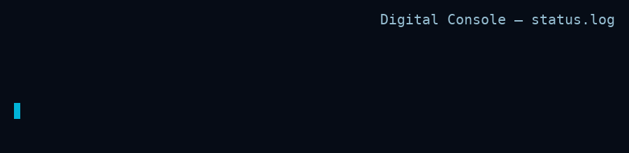

# Smart Student Management System (SSMS)

<div align="center">



**A comprehensive, intelligent student management platform with QR code attendance tracking**

[](https://www.python.org/)
[](https://www.djangoproject.com/)
[](LICENSE)

</div>

---

## 📋 Table of Contents

- [Overview](#overview)
- [Features](#features)
- [System Architecture](#system-architecture)
- [Technology Stack](#technology-stack)
- [Installation](#installation)
- [Usage](#usage)
- [Advanced Features](#advanced-features)
- [Project Structure](#project-structure)
- [Contributing](#contributing)
- [License](#license)

---

## 🎯 Overview

The **Smart Student Management System (SSMS)** is not just a simple attendance tracker—it's a comprehensive, enterprise-grade platform designed with proper software architecture principles. Built for universities and educational institutions, SSMS provides:

- **Centralized Data Management**: Single source of truth for student records
- **QR Code Technology**: Automated attendance with unique QR codes per student
- **Advanced Analytics**: Real-time insights into attendance patterns and student performance
- **Security Features**: Geo-fencing, audit logs, and role-based access control

---

## ✨ Features

### Core Features (MVP)

✅ **Student Management**
- Complete CRUD operations for student records
- Automatic UUID generation for each student
- QR code generation and management
- CSV/Excel import for bulk student data

✅ **Session Management**
- Support for multiple session types (Lecture, Lab, Exam, Assignment)
- Date and time tracking
- Location information
- Session history

✅ **Attendance Tracking**
- QR code scanning via web camera
- Multiple attendance statuses (Present, Late, Absent, Excused, Submitted)
- Real-time attendance recording
- Timestamp and location logging

✅ **Admin Dashboard**
- Comprehensive statistics overview
- Real-time attendance monitoring
- Student performance analytics
- At-risk student identification

✅ **Reporting**
- Excel export with professional formatting
- Customizable attendance reports
- Statistical summaries

### Advanced Features

🚀 **Geo-Fencing Security**
- Location-based attendance verification
- Prevents remote attendance fraud
- GPS coordinate validation

🔐 **Audit Logging**
- Complete activity tracking
- User action monitoring
- IP address logging
- Security compliance

🏆 **Gamification System**
- Student badges and achievements
- Points system
- Performance recognition
- Motivation through competition

📊 **Data Analytics**
- Attendance percentage calculations
- Trend analysis
- Performance predictions
- At-risk student detection

🎨 **Modern UI/UX**
- Responsive design (mobile-friendly)
- Clean, intuitive interface
- Real-time feedback
- Professional aesthetics using Tailwind CSS

---

## 🏗️ System Architecture

The system follows a **3-tier architecture**:

```
┌─────────────────────────────────────────┐
│        Presentation Layer               │
│  (HTML, CSS, JavaScript, Tailwind)      │
└─────────────────┬───────────────────────┘
                  │
┌─────────────────▼───────────────────────┐
│        Application Layer                │
│    (Django Views, Business Logic)       │
└─────────────────┬───────────────────────┘
                  │
┌─────────────────▼───────────────────────┐
│         Data Layer                      │
│   (Django ORM, SQLite/PostgreSQL)       │
└─────────────────────────────────────────┘
```

### Database Schema

**Students Table**
- UUID (unique identifier for QR)
- University ID
- Name, Email, Phone
- QR Code image
- Attendance percentage
- Total points (gamification)

**Sessions Table**
- Title, Type, Date, Time
- Location
- Geo-fencing coordinates
- Description

**AttendanceLog Table**
- Student (FK)
- Session (FK)
- Status
- Timestamp
- GPS coordinates
- Recorded by

**AuditLog Table**
- Action type
- User
- Description
- IP address
- Timestamp

**Badge & StudentBadge Tables**
- Badge information
- Student-badge relationships
- Award timestamps

---

## 💻 Technology Stack

### Backend
- **Python 3.12+** - Core programming language
- **Django 5.0+** - Web framework
- **SQLite/PostgreSQL** - Database (SQLite for development, PostgreSQL recommended for production)

### Frontend
- **HTML5** - Structure
- **Tailwind CSS** - Styling
- **JavaScript** - Interactivity
- **html5-qrcode** - QR code scanning library
- **Font Awesome** - Icons

### Libraries & Tools
- **qrcode** - QR code generation
- **Pillow** - Image processing
- **openpyxl** - Excel file handling
- **reportlab** - PDF generation
- **pyotp** - TOTP for dynamic QR codes (future)

---

## 📦 Installation

### Prerequisites
- Python 3.12 or higher
- pip (Python package manager)
- Git

### Step 1: Clone the Repository
```bash
git clone https://github.com/InfoSecNazir/InfoSecNazir.git
cd InfoSecNazir
```

### Step 2: Create Virtual Environment (Recommended)
```bash
python -m venv venv
source venv/bin/activate  # On Windows: venv\Scripts\activate
```

### Step 3: Install Dependencies
```bash
pip install -r requirements.txt
```

### Step 4: Apply Migrations
```bash
python manage.py migrate
```

### Step 5: Create Superuser
```bash
python manage.py createsuperuser
```

### Step 6: Run Development Server
```bash
python manage.py runserver
```

The application will be available at `http://127.0.0.1:8000/`

---

## 🚀 Usage

### Admin Panel
1. Navigate to `http://127.0.0.1:8000/admin/`
2. Login with your superuser credentials
3. Add students, create sessions, manage badges

### QR Code Generation
1. Go to Admin → Students
2. Add a new student (or import from CSV)
3. QR code is automatically generated
4. Download and print QR codes for student ID cards

### Attendance Scanning
1. Navigate to `http://127.0.0.1:8000/scanner/`
2. Select a session
3. Choose attendance status
4. Click "Start Scanner" and scan student QR codes
5. Or manually enter student UUID

### Dashboard & Reports
1. View dashboard at `http://127.0.0.1:8000/dashboard/`
2. Monitor real-time statistics
3. Export reports via "Export to Excel" button

---

## 🎯 Advanced Features

### Geo-Fencing Setup
1. In Admin panel, create/edit a session
2. Enter latitude and longitude
3. Set geo-fence radius (in meters)
4. System will validate student location during scan

### Gamification System
1. Create badges in Admin → Badges
2. Define badge types and point requirements
3. Badges are automatically awarded based on attendance
4. Students can view their badges in their profile

### Audit Logging
All system actions are automatically logged:
- Student QR scans
- Data exports
- Record modifications
- User activities

View logs in: Admin → Audit Logs

---

## 📁 Project Structure

```
InfoSecNazir/
├── manage.py                   # Django management script
├── requirements.txt            # Python dependencies
├── .gitignore                 # Git ignore rules
├── README_SSMS.md             # This file
│
├── ssms_project/              # Main project configuration
│   ├── settings.py            # Django settings
│   ├── urls.py                # URL routing
│   └── wsgi.py                # WSGI configuration
│
├── students/                  # Main application
│   ├── models.py              # Database models
│   ├── views.py               # View functions
│   ├── urls.py                # App URL routing
│   ├── admin.py               # Admin configuration
│   └── migrations/            # Database migrations
│
├── templates/                 # HTML templates
│   ├── base.html              # Base template
│   └── students/              # Student app templates
│       ├── home.html
│       ├── scanner.html
│       ├── dashboard.html
│       ├── student_list.html
│       └── session_list.html
│
├── static/                    # Static files (CSS, JS)
└── media/                     # User uploads (QR codes)
    └── qr_codes/              # Generated QR codes
```

---

## 🛣️ Roadmap

### Phase 1 (MVP) ✅ COMPLETED
- [x] Database models
- [x] QR code generation
- [x] Admin interface
- [x] Basic attendance tracking

### Phase 2 (Scanner) ✅ COMPLETED
- [x] Web-based QR scanner
- [x] Real-time scanning
- [x] Multiple status support

### Phase 3 (Dashboard) ✅ COMPLETED
- [x] Statistics dashboard
- [x] Excel export
- [x] Data analytics

### Phase 4 (Advanced Features) 🔄 IN PROGRESS
- [x] Geo-fencing support (models ready)
- [x] Audit logging
- [x] Gamification system (models ready)
- [ ] Dynamic QR codes (TOTP)
- [ ] Email notifications
- [ ] PWA (Offline mode)

### Phase 5 (Security & Testing) 📅 PLANNED
- [ ] Authentication system
- [ ] Role-based access control
- [ ] Comprehensive testing
- [ ] Security hardening
- [ ] Documentation completion

---

## 🤝 Contributing

Contributions are welcome! Please follow these steps:

1. Fork the repository
2. Create a feature branch (`git checkout -b feature/AmazingFeature`)
3. Commit your changes (`git commit -m 'Add some AmazingFeature'`)
4. Push to the branch (`git push origin feature/AmazingFeature`)
5. Open a Pull Request

---

## 📄 License

This project is licensed under the MIT License - see the [LICENSE](LICENSE) file for details.

---

## 👨‍💻 Author

**Nazeer Al-Habash**

- GitHub: [@InfoSecNazir](https://github.com/InfoSecNazir)
- LinkedIn: [Mohammed Nazir Al-Habash](https://www.linkedin.com/in/mohammed-nazir-al-habash-6b7385319)
- Email: Hnzyr31@gmail.com

---

## 🙏 Acknowledgments

- Damascus University - Computer Engineering Department
- Dr. Mohammed Abu Hadhoud - OOP Course
- Open source community for excellent libraries

---

## 📞 Support

For support, please:
- Open an issue on GitHub
- Email: Hnzyr31@gmail.com
- LinkedIn: [Mohammed Nazir Al-Habash](https://www.linkedin.com/in/mohammed-nazir-al-habash-6b7385319)

---

<div align="center">

**⭐ If you find this project useful, please consider giving it a star! ⭐**

Made with ❤️ by Nazeer Al-Habash

</div>
